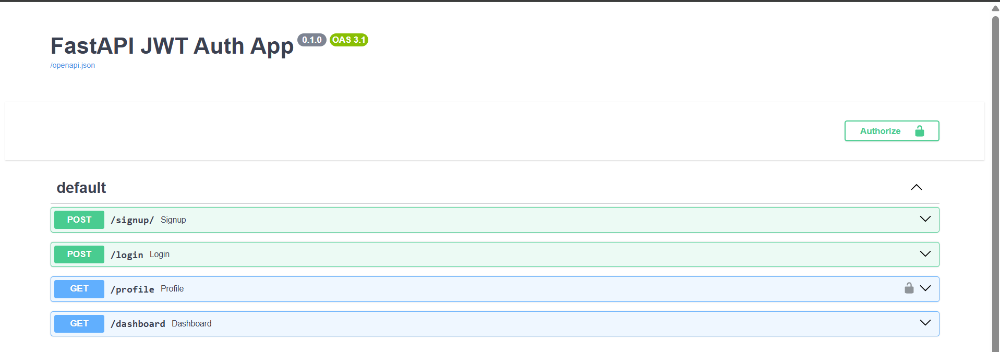
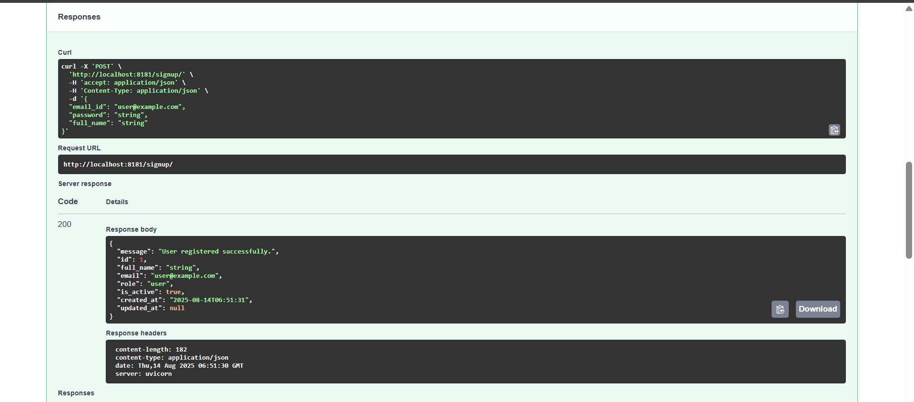
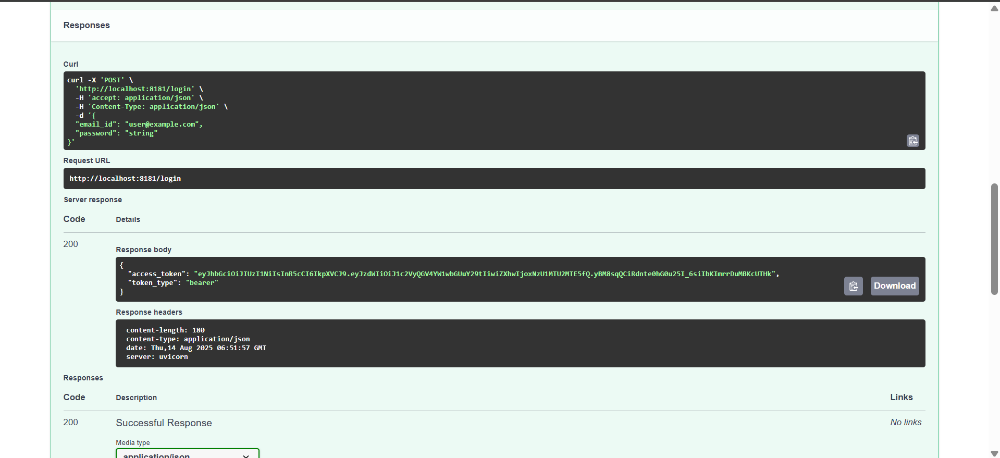
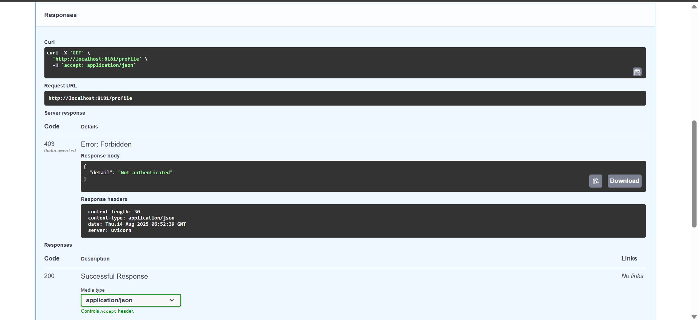
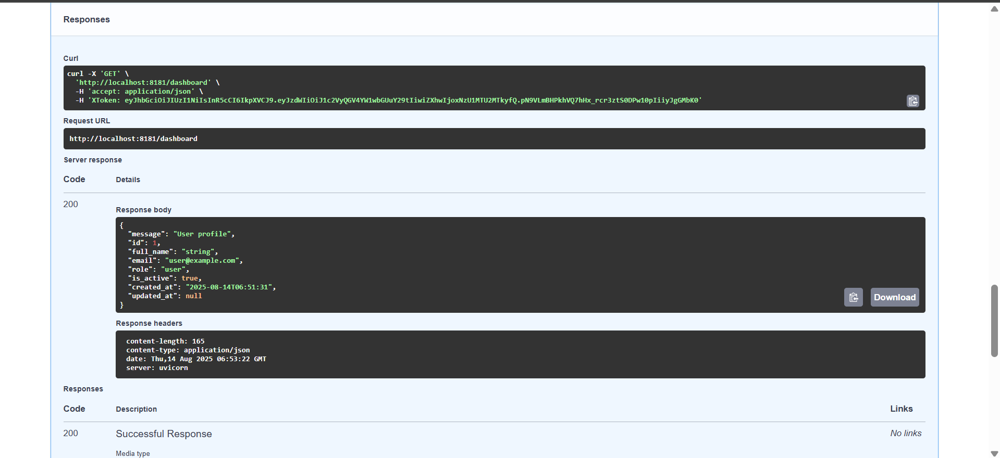
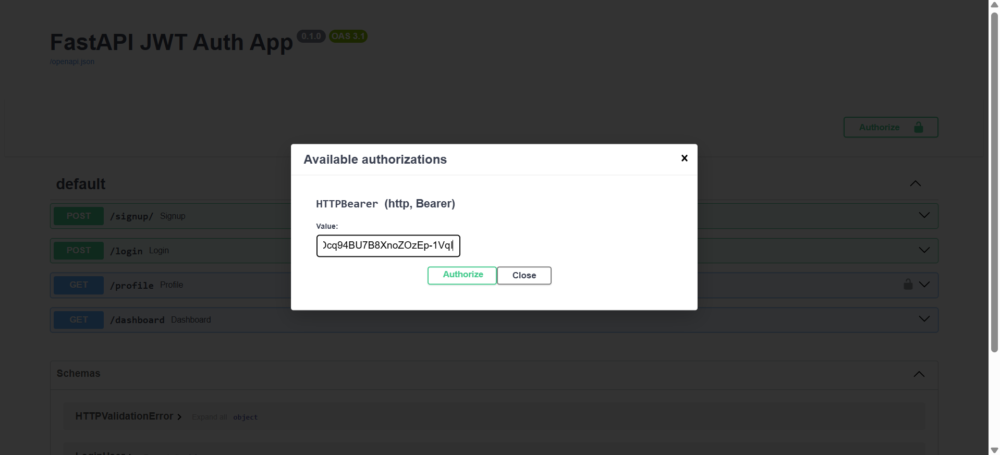
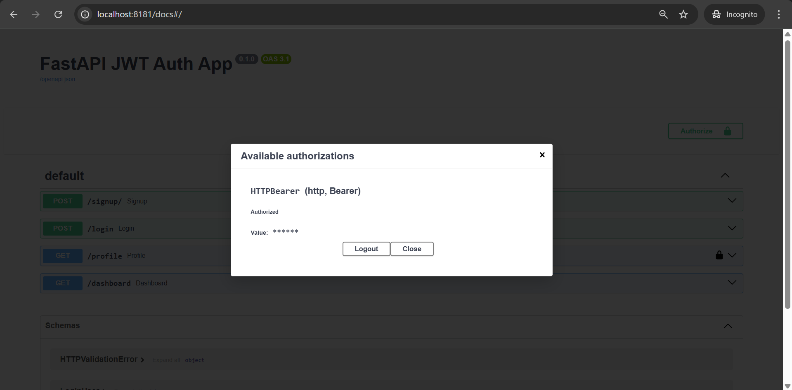

# 🔐 FastAPI Authentication with JWT, Header and Local Database

A simple authentication and user profile management API built with **FastAPI**, using **JWT tokens** for secure
authentication.

---

## 🚀 Features

- JWT-based Authentication
- User registration (`/signup`)
- User login with JWT token generation (`/login`)
- Authenticated profile retrieval (`/profile`)
- Token Header-Based Access (`/dashboard`)
- Secure password hashing with bcrypt
- SQLite database integration with sqlalchemy
- Environment variable management with `.env`

---

## 🧪 API Endpoints

POST

```curl
curl -X 'POST' \
  'http://localhost:8181/signup/' \
  -H 'accept: application/json' \
  -H 'Content-Type: application/json' \
  -d '{
  "email_id": "user@example.com",
  "password": "string",
  "full_name": "string"
}'
```

| Method | Endpoint     | Description                          | Auth Required |
|--------|--------------|--------------------------------------|---------------|
| POST   | `/signup`    | Register a new user                  | ❌             |
| POST   | `/login`     | Login and get JWT token              | ❌             |
| GET    | `/profile`   | Get current user info (Header Based) | ✅             |
| GET    | `/dashboard` | Get current user info (Token Based)  | ✅             | 

---

## Screenshot










---

## logs

```text
(.venv) PS C:\Users\Admin\Workspace\fastapi-oauth2\2_With_Database_And_Header> python .\main.py
INFO:     Will watch for changes in these directories: ['C:\\Users\\Admin\\Workspace\\fastapi-oauth2\\2_With_Database_And_Header']
INFO:     Uvicorn running on http://0.0.0.0:8181 (Press CTRL+C to quit)
INFO:     Started reloader process [22404] using StatReload
INFO:     Started server process [21964]
INFO:     Waiting for application startup.
INFO:     Application startup complete.
INFO:     127.0.0.1:61519 - "GET /docs HTTP/1.1" 200 OK
INFO:     127.0.0.1:61519 - "GET /openapi.json HTTP/1.1" 200 OK
INFO:     127.0.0.1:61524 - "POST /signup/ HTTP/1.1" 200 OK
INFO:     127.0.0.1:61536 - "POST /login HTTP/1.1" 200 OK
INFO:     127.0.0.1:61537 - "GET /profile HTTP/1.1" 403 Forbidden
INFO:     127.0.0.1:61568 - "POST /login HTTP/1.1" 200 OK
INFO:     127.0.0.1:61569 - "GET /dashboard HTTP/1.1" 200 OK
INFO:     127.0.0.1:61583 - "POST /login HTTP/1.1" 200 OK
INFO:     127.0.0.1:61613 - "GET /profile HTTP/1.1" 200 OK

```


