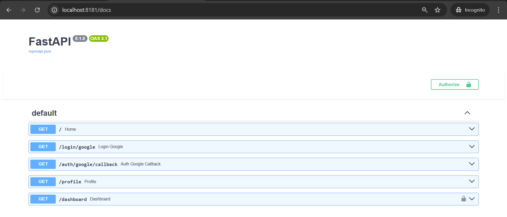
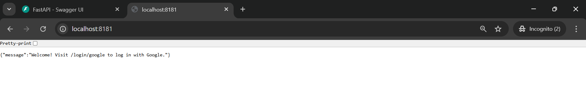
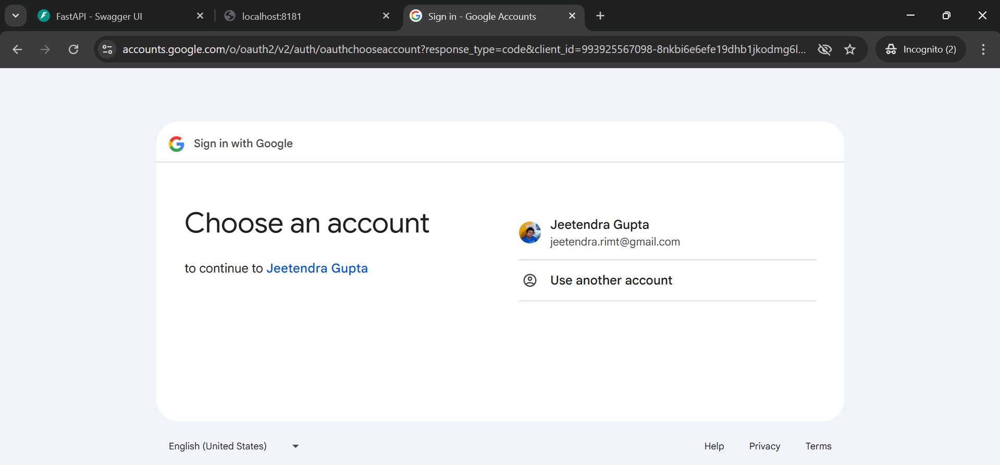
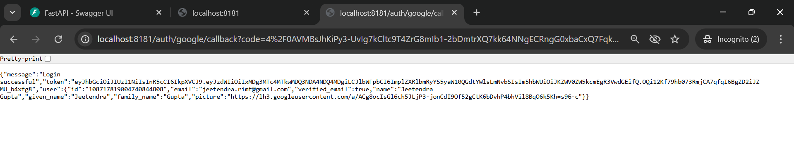
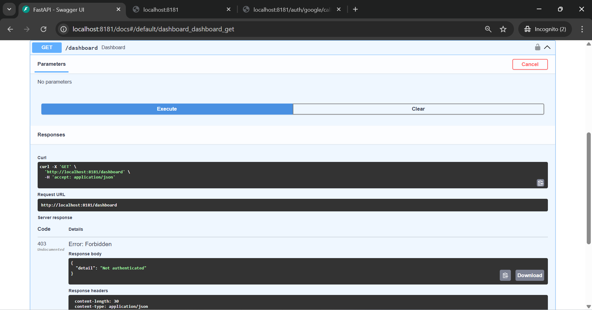
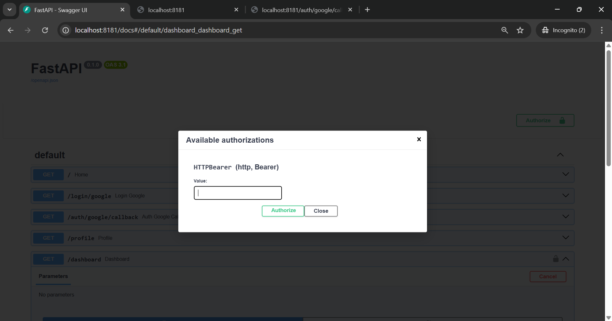
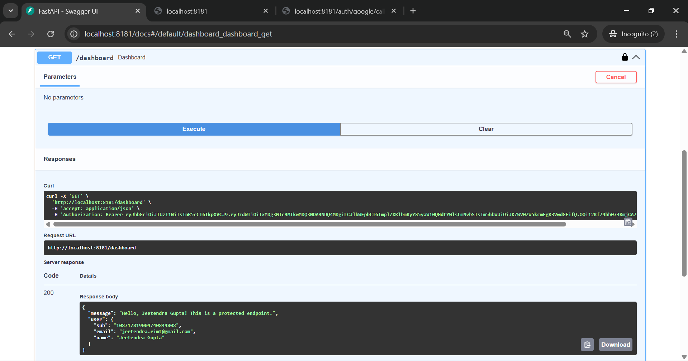
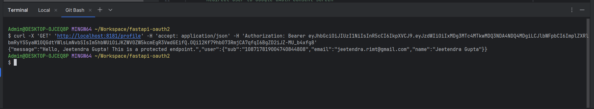

# 🌐 FastAPI Google OAuth2 + JWT Auth

This project demonstrates how to implement **Google OAuth 2.0 Login** and **JWT authentication** in a FastAPI
application.

Users authenticate via Google, and a JWT token is issued upon successful login. The token can be used to access
protected endpoints like `/profile` and `/dashboard`.

---

## 🚀 Features

- Google OAuth 2.0 login
- JWT token generation
- Protected routes using JWT
- Easy-to-follow FastAPI structure
- Header-based token authentication

---

## ⚙️ Environment Variables

Create a `.env` file in the root directory with the following:

```env
GOOGLE_CLIENT_ID=your-google-client-id
GOOGLE_CLIENT_SECRET=your-google-client-secret
GOOGLE_REDIRECT_URI=http://localhost:8181/auth/google/callback

JWT_SECRET_KEY=your_jwt_secret
JWT_ALGORITHM=HS256
````

**🔐 Required:**
Ensure your redirect URI in the Google Cloud Console matches `GOOGLE_REDIRECT_URI`.

---

## 🧪 How to Use

### 1. 🔗 Login with Google

* Go to: `http://localhost:8181/login/google`
* You'll be redirected to Google login
* On successful login, you'll be redirected to `/auth/google/callback`
* You’ll receive a response like:

```json
{
  "message": "Login successful",
  "token": "your.jwt.token",
  "user": {
    "id": "google_user_id",
    "email": "you@example.com",
    "name": "Your Name"
  }
}
```

Copy the token for use in the next steps.

---

### 2. 🔒 Access Protected Route `/profile`

**Request:**

```http
GET /profile
Authorization: Bearer your.jwt.token
```

**Response:**

```json
{
  "message": "Hello, Your Name! This is a protected endpoint.",
  "user": {
    "sub": "google_user_id",
    "email": "you@example.com",
    "name": "Your Name"
  }
}
```

---

### 3. 🔒 Access Protected Route `/dashboard`

**Request:**

```http
GET /dashboard
Authorization: Bearer your.jwt.token
```

**Response:**

```json
{
  "message": "Hello, Your Name! This is a protected endpoint.",
  "user": {
    "sub": "google_user_id",
    "email": "you@example.com",
    "name": "Your Name"
  }
}
```

---

## 🗂️ Project Structure

```
.
├── main.py               # Main FastAPI app with routes
├── config.py             # Environment configuration
├── .env                  # Your secrets and keys (not to be committed)
├── requirements.txt      # Python dependencies
└── README.md             # This file
```

---

# Notebook

## ✅ Step 1: Go to Google Cloud Console

Visit: [https://console.cloud.google.com/](https://console.cloud.google.com/)

---

## ✅ Step 2: Create a New Project (if needed)

* Click the **project dropdown** on top.
* Click **New Project**.
* Enter a project name and click **Create**.
* Once created, **select** the project.

---

## ✅ Step 3: Enable Google OAuth API

1. In the left menu, go to **APIs & Services > Library**
2. Search for **"Google+ API"** or **"Google People API"**
3. Click on it and click **Enable**

---

## ✅ Step 4: Create OAuth Consent Screen

1. Go to **APIs & Services > OAuth consent screen**
2. Choose **External** and click **Create**
3. Fill in:
    * **App name**
    * **User support email**
    * **Developer contact email**
4. Click **Save and Continue** through the scopes and test users (you can add your Gmail here for testing)

---

## ✅ Step 5: Create OAuth Credentials

1. Go to **APIs & Services > Credentials**
2. Click **+ Create Credentials** > **OAuth client ID**
3. Choose **Web application**
4. Set a **Name** (e.g., `FastAPI OAuth App`)
5. Under **Authorized redirect URIs**, add:

```
http://localhost:8181/auth/google/callback
```

> This should match your app’s `GOOGLE_REDIRECT_URI`.

6. Click **Create**

---

## ✅ Step 6: Copy Your Credentials

After creating, Google will show:

* **Client ID**
* **Client Secret**

Copy and paste them into your `.env` file:

```env
GOOGLE_CLIENT_ID=your-client-id
GOOGLE_CLIENT_SECRET=your-client-secret
GOOGLE_REDIRECT_URI=http://localhost:8181/auth/google/callback
```

---

## Screenshot








