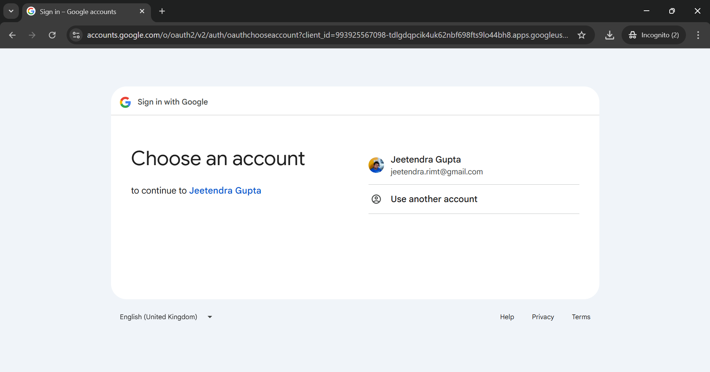
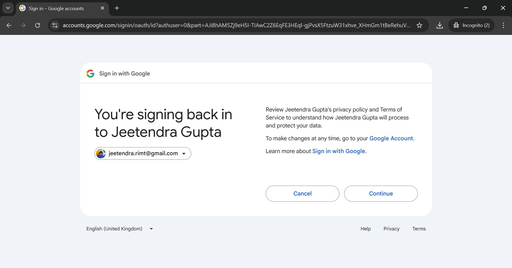
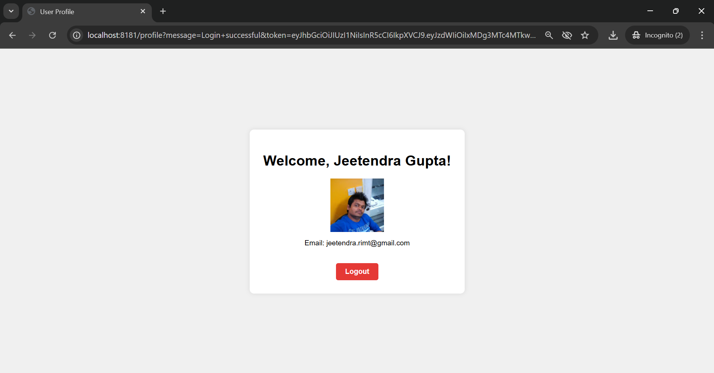
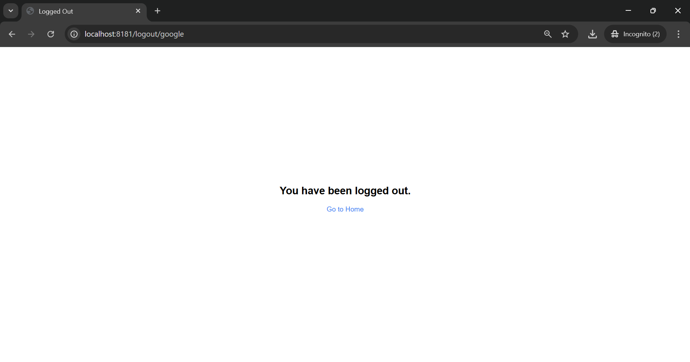

# 🚀 FastAPI Google OAuth2 Login

A simple FastAPI web application that integrates Google OAuth2 authentication, displays the user's profile, and allows
logout.

---

## ✨ Features

- Login using your Google account
- Fetch and display user profile data
- JWT token generation
- Clean, responsive UI with basic CSS
- Logout functionality

---

## 🧾 Requirements

- Python 3.8+
- A Google Cloud project with OAuth 2.0 credentials

---

## 🖼️ Screenshots

> Index Page
> 

> Google Login Form
> 
> 

> Dashboard
> 

> Logout
> 

---

## 🔐 Security Notes

* Avoid passing user data in URL query strings in production — use sessions or tokens.
* Use HTTPS in production to protect sensitive OAuth traffic.
* Store secrets securely using `.env` files or secret managers.

---

